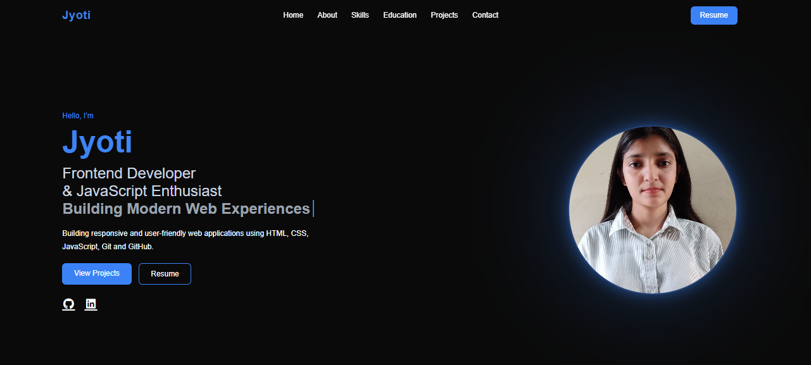

# Jyoti Maan | Frontend Developer Portfolio

A modern, responsive, and interactive personal portfolio website built to showcase my skills, projects, education, and frontend development journey.

The portfolio features a premium dark theme, smooth animations, project showcases with screenshots, and a mobile-friendly user experience.

---

## Portfolio Preview

---

## Features

- Modern dark UI design
- Responsive layout for all devices
- Interactive hero section
- Typing text animation
- Smooth scroll reveal animations
- Profile image with glow effect
- Skills showcase section
- Education timeline/cards
- Premium project cards with screenshots
- Tech stack badges
- Project Live Demo and GitHub links
- Contact section with social links
- Optimized and clean user interface

---

## Technologies Used

### Frontend

- HTML5
- CSS3
- JavaScript (ES6)

### Tools

- Git
- GitHub
- VS Code

---

## Project Structure

portfolio-website/
│
├── index.html
├── style.css
├── script.js
│
├── assets/
│   ├── profile.jpg
│   ├── resume.pdf
│   ├── To-Do-App.png
│   ├── E-Commerce.png
│   ├── HeathyHubRestaurant.png
│   ├── Recipe-Book.png
│   └── portfolio-preview.png
│
└── README.md
---

## Featured Projects

### 1. To-Do-app

### 2. Recipe-Book Web Application

### 3. Responsive E-commerce Website

### 4. HeathyHub Restaurant Website

---

## Installation & Setup

1. Clone the repository:

git clone https://github.com/code-by-jyoti/portfolio.git
2. Navigate to the project folder:

cd portfolio
3. Open index.html in your browser.

---

## Responsive Design

The website is fully responsive and optimized for:

- Mobile phones
- Tablets
- Laptops
- Desktop screens

---

## Contact

Email: jyotiswami225@gmail.com

LinkedIn: https://linkedin.com/in/jyoti145

GitHub: https://github.com/code-by-jyoti

---

## GitHub Workflow

This project was developed using a professional GitHub workflow:

- GitHub Issues
- Feature Branches
- Pull Requests
- Meaningful Commit Messages
- Self Code Reviews
- Development and Main Branch Strategy

---

## License

This project is open source and available for learning and personal use.

---

### If you like this project, consider giving it a star.